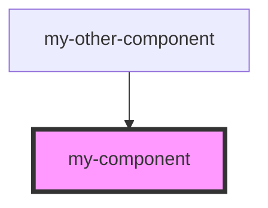

# my-component

Some text goes to auto generated readme.md

<!-- Auto Generated Below -->

## Properties

| Property | Attribute | Description      | Type       | Default     |
| -------- | --------- | ---------------- | ---------- | ----------- |
| `first`  | `first`   | The first name   | `string`   | `undefined` |
| `items`  | --        | Array of strings | `string[]` | `[]`        |
| `last`   | `last`    | The last name    | `string`   | `undefined` |
| `middle` | `middle`  | The middle name  | `string`   | `undefined` |

## Dependencies

### Used by

 - [my-other-component](../my-other-component)

### Graph

----------------------------------------------

*Built with [StencilJS](https://stenciljs.com/)*
